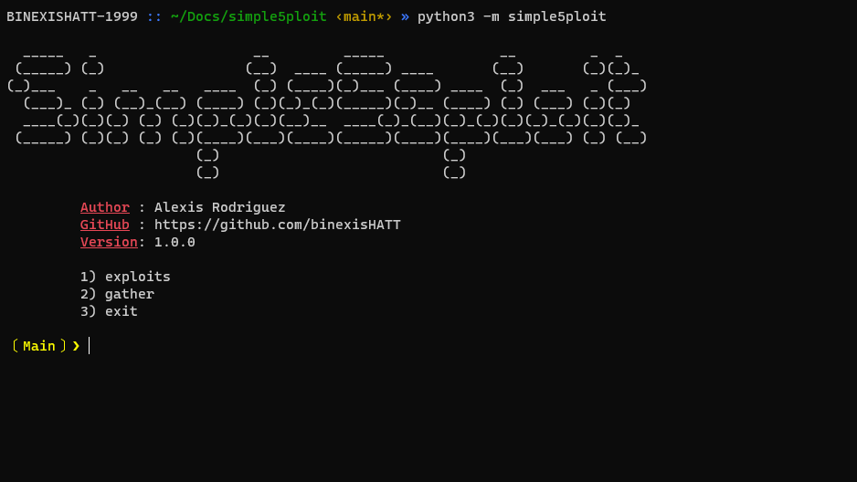
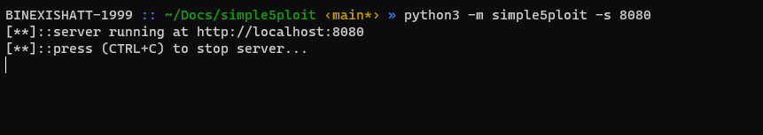

# simple5ploit
`simple5ploit` is an exploitation/information gathering framework designed for Python3 scripts.

### Setup

**NOTE: I haven't upload ths project to PYPI just yet this `pip install` doesn't work.**

```
python3 -m pip install simple5ploit
```

**OR**

```
git clone https://github.com/binexisHATT/simple5ploit
cd simple5ploit
python3 -m simple5ploit
```

- built with `flit` and uploaded to test.pyp.org with `twine upload --repository-url https://test.pypi.org/legacy/ dist/*`
  - `pip3 install flit && flit build`

### Simple5ploit's Interface

**simple5ploit: Main Interface**



**simple5ploit: CLI Help Menu**

```
usage: python3 -m simple5ploit [-h] [-q] [-l] [-m MODULE] [-s PORT]

optional arguments:
  -h, --help            show this help message and exit
  -q, --quite           don't print simple5ploit banner
  -l, --list-modules    list all available modules
  -m MODULE, --module MODULE
                        specify module to load
  -s PORT, --server PORT
                        HTTP server using `http.server` module
```
**simple5ploit: Autotab Completion Capabilites**


**simple5ploit: Listing Available Modules And Loading Directly Into Them**


### Contributing to Simple5ploit

1. Fork simple5ploit's repo
2. Watch this [video](https://www.youtube.com/watch?v=nT8KGYVurIU) on how to fork and make pull requests if you don't know how to do so already
3. Make a pull request with your exploit or gather module and I'll add your exploit or gather module to simple5ploit

### Creating an Exploit Module

**NOTE**: all exploit modules created should exist in the path: `simple5ploit/simple5ploit/modules/exploits` and must end with a `.py` extension!!!

```python
# importing the parent exploit class
from .internal.base import Exploit

# defining an exploit module class
class SomeExploit(Exploit):
  def __init__(self):
    # exploit module custom prompt
    self.prompt = "[CustomExploitPrompt] :> "

    # exploits pip dependencies
    self.pip_dependencies = [
      "requests",
      "impacket"
    ]
    
    # exploit module information dict
    self.info = {
      "Author": "Alexis Rodriguez",
      "Description": "An example exploit class"
    }
    
    # exploit module arguments dict
    self.args = {
      "some_argument":
        {
          "description": "an argument for this example exploit class",
          "required": True }
    }
    
    # initializing class variables for exploit arguments with values set to `N/a`
    # ::they could also be set to empty string
    for arg in self.args.keys():
      self.__dict__[arg] = "N/a"
      
  def check(self):
    """
    If implemented, this function checks if the target
    is vulnerable to the exploit. If it's not implemented,
    a ```NotImplementedError``` will be raised and handled accordingly by
    simple5ploit's cli
    """
    pass
        
  def run(self):
    """
    This function is where the exploit code should be placed.
    If it's not implemented, a ```NotImplementedError``` will be raised
    and handled accordingly by simple5ploit's cli.
    """
    pass
    
```

### Creating a Gather Module

**NOTE**: all gather modules created should exist in the path: `simple5ploit/simple5ploit/modules/gather` and must end with a `.py` extension!!!

```python3
# importing the parent gather module class
from .internal.base import Gather

# defining a gather module class
class SomeGatherModule(Gather):
  def __init__(self):
    # gather module custom prompt
    self.prompt = "[CustomPrompt] % "

    # exploits pip dependencies
    self.pip_dependencies = [
      "psutil",
      "pefile"
    ]
    
    # gather module information dict
    self.info = {
      "Author": "Alexis Rodriguez",
      "Description": "An example informating gather module class"
    }
    
    # gather module arguments dict
    self.args = {
      "some_argument":
        {
          "description": "an argument for this example gather module class",
          "required": True }
    }
    
    # initializing class variables for script arguments with values set to `N/a`
    # ::they could also be set to empty string
    for arg in self.args.keys():
      self.__dict__[arg] = "N/a"
      
  def run(self):
    """
    This function is where the code for this gather module should be placed.
    If it's not implemented, a ```NotImplementedError``` will be raised.
    """
    pass
```

### Simple5ploit Server

Quickly launch a Python3 HTTP server with:

```
simple5ploit -s [port]
```


